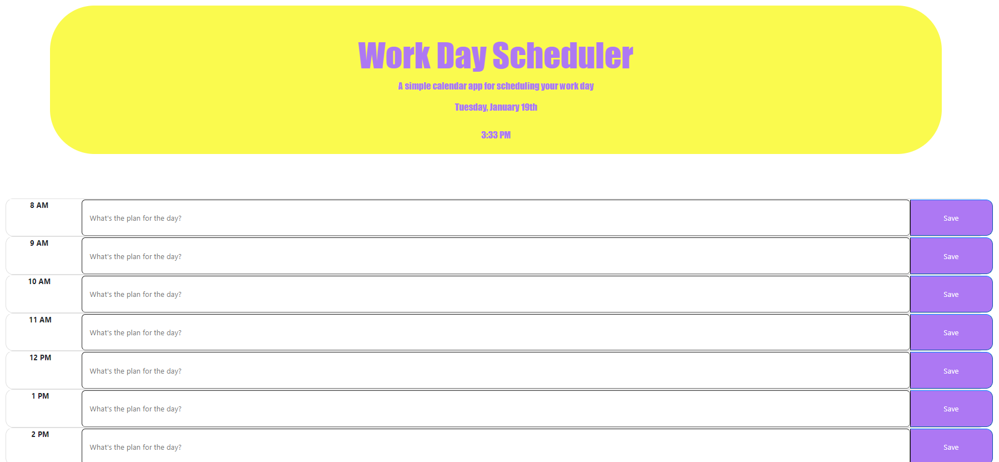

# Code Quiz

## Description 

A simple calendar application that allows a user to save events for each hour of the day by modifying starter code. This app will run in the browser and feature dynamically

## User Story

AS AN employee with a busy schedule
I WANT to add important events to a daily planner
SO THAT I can manage my time effectively

### App screenshot

   

## Table of contents

- [Description](#Description)
- [Usage](#Usage)
- [Technologies](#Technologies)
- [Licence](#Licence)
- [Repository Link](#Repository)
- [GitHub Info](#GitHub) 

## Usage

Go to [Day-Planner](https://morrow7564.github.io/Day-Planner/) 

## Technologies
* JavaScript
* jQuery

## Licence

## Repository

- [Project Repo](https://github.com/morrow7564/Day-Planner)

## GitHub

- Christopher Morrow
- [GitHub Profile](https://github.com/morrow7564)

